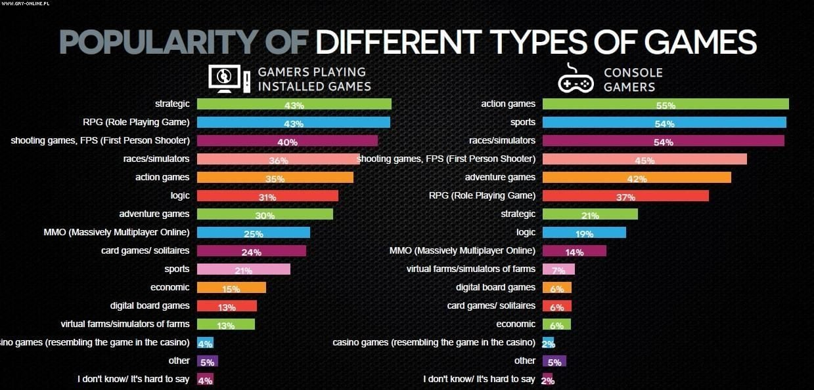

Sportowe
--------

Gry sportowe odwzorowują dyscypliny fizyczne, a wyścigowe skupiają się
na prowadzeniu pojazdów. Przykłady:

-  **FIFA, NBA 2K** – symulacje piłki nożnej i koszykówki.

-  **Gran Turismo, Forza Horizon** – realistyczne wyścigi samochodowe.

-  **Tony Hawk’s Pro Skater** – symulacja jazdy na deskorolce.

Często zawierają tryby kariery, multiplayer i licencjonowane drużyny.

Współczesne gry coraz częściej łączą cechy różnych gatunków. Przykłady:

-  **Gry survivalowe** – *Rust*, *Subnautica*. Przetrwanie w trudnych
   warunkach, zbieranie zasobów, budowanie.

-  **Battle Royale** – *Fortnite*, *PUBG*. Walka wielu graczy na jednej
   mapie do ostatniego ocalałego.

-  **MMORPG** – *World of Warcraft*, *Final Fantasy XIV*. Tysiące graczy
   w jednym świecie, wspólne misje i rozwój postaci.

-  **Roguelike / Roguelite** – *Hades*, *Dead Cells*. Losowo generowane
   poziomy, permadeath, wysoki poziom trudności.

**Szacowana liczba graczy według gatunku (2025)**

+-----------------------+-----------------------+-----------------------+
| **Gatunek gry**       | **Szacowana liczba    | **Przykładowe         |
|                       | graczy**              | tytuły**              |
+=======================+=======================+=======================+
| RPG z otwartym        | ok. 300–400 mln       | Wuthering Waves,      |
| światem               |                       | Everwind, Skyrim      |
+-----------------------+-----------------------+-----------------------+
| Strzelanki FPS/TPS    | ok. 500–600 mln       | Call of Duty,         |
|                       |                       | BattleBit, Killing    |
|                       |                       | Floor 3               |
+-----------------------+-----------------------+-----------------------+
| Gry strategiczne      | ok. 100–150 mln       | Civilization VII,     |
|                       |                       | Falling Frontier      |
+-----------------------+-----------------------+-----------------------+
| Gry survivalowe       | ok. 200–300 mln       | Rust, Subnautica,     |
|                       |                       | Aloft                 |
+-----------------------+-----------------------+-----------------------+
| Symulatory            | ok. 100 mln           | The Sims, Cities:     |
| życia/zarządzania     |                       | Skylines II           |
+-----------------------+-----------------------+-----------------------+

|image1|

